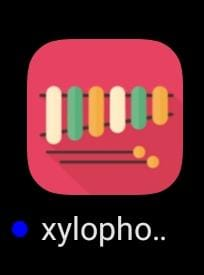
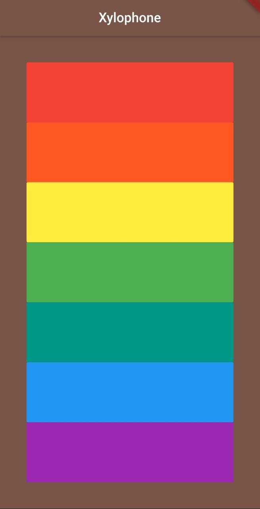

# Xylophone

This is a simple flutter app of an Xylophone. This xylophone version consists of 7 colours and a different xylophone tone comes out whenever you hit any one the colours. 

## App icon :- 

## App UI :- 

This is a basic flutter app for practice/experiment purpose.
